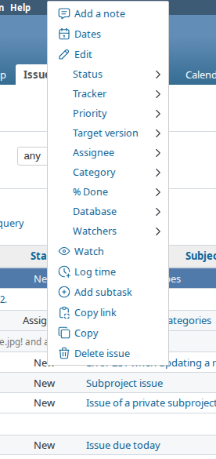
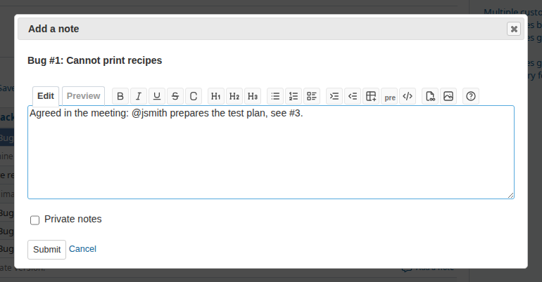
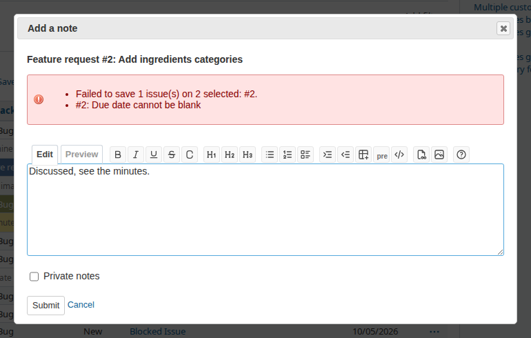
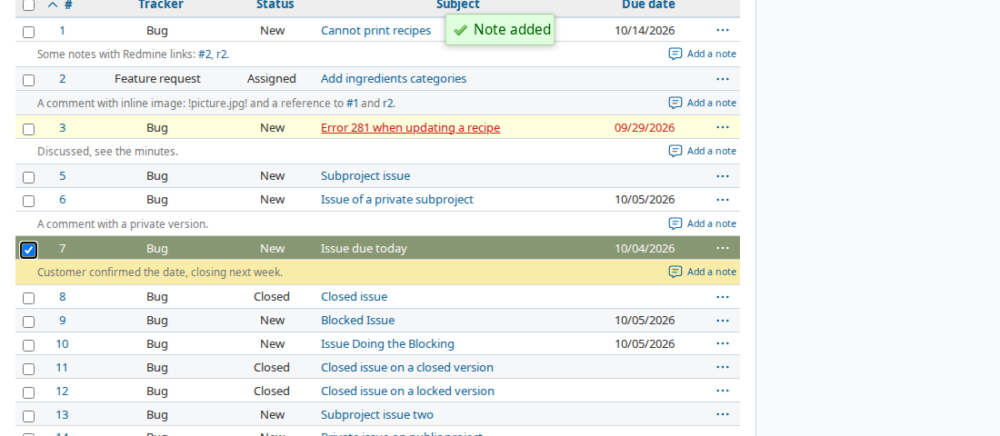
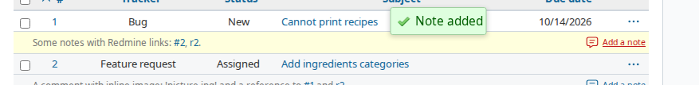
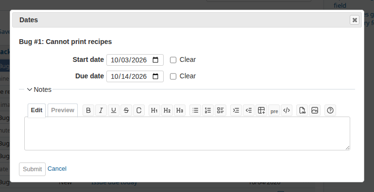
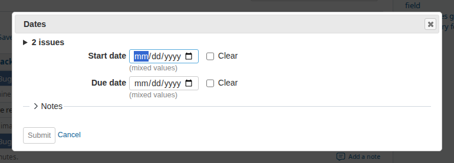
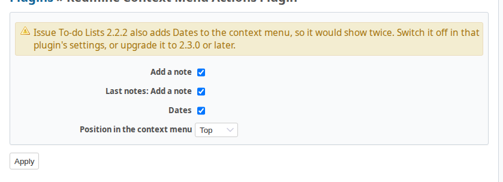

# Redmine Context Menu Actions Plugin

Quick actions in the issue context menu, for working down a filtered issue list,
for example in a meeting: read the last note, add a new one, next issue. No page
reload, no lost scroll position, no lost selection.

* **Add a note** to one or several issues, from the context menu.
* **Add a note** straight from the Last notes block of the issue list.
* **Dates**: change or clear the start and due date of one or several issues.

No permissions of its own, no project module, no database migration, no core
file changed. Every action is allowed exactly when Redmine allows the same change
on the issue page.



## Compatibility

Redmine 5.1, 6.0, 6.1 and 7.0, on PostgreSQL and MySQL. Ruby 3.0 or later.

Every push runs the whole suite on each combination below, against a real
database server, and the browser specs in Chromium on every version (on
PostgreSQL, and on MySQL for 6.1):

| Redmine branch | Rails | Ruby (CI) | PostgreSQL | MySQL |
|---|---|---|---|---|
| 5.1-stable | 6.1 | 3.2 | 16 | 8 |
| 6.0-stable | 7.2 | 3.3 | 16 | 8 |
| 6.1-stable | 7.2 | 3.4 | 16 | 8 |
| 7.0-stable | 8.1 | 3.4 | 16 | 8 |

A weekly run repeats the table against the tip of each branch and Redmine trunk.
[COMPATIBILITY.md](COMPATIBILITY.md) lists every place where the plugin relies on
Redmine internals; `spec/core_contract_spec.rb` asserts each of them.

Translated into all 50 languages Redmine ships. Most words are Redmine's own
(Add a note, Notes, Start date, Clear, ...), so the plugin reads like the rest of
Redmine in every language. See [TRANSLATING.md](TRANSLATING.md).

## Features

### Add a note

Right click one or more issues, choose **Add a note**.



* The dialog names the issue, or the number of issues with the list behind it.
* The notes field works like the one on the issue page: wiki toolbar with
  preview, `#` issue and `@` user autocomplete, list autofill (6.1) and the
  textarea helpers of 7.0.
* **Private notes** is offered when every selected issue allows it.
* The cursor is in the field when the dialog opens. **Ctrl+Enter** (Cmd+Enter on
  a Mac) submits. **Esc** closes the dialog at once; the close button and
  **Cancel** ask first when typed text or changed dates would be lost, and so
  does leaving the page. Both follow the Redmine preference "Warn me when leaving
  a page with unsaved text". Submit is off while the note is empty or while a
  request runs.
* After a save the dialog closes. The Last notes block of every saved issue on the
  page is replaced, or added when the list shows Last notes and the issue had
  none. The changed rows light up for a moment and "Note added" stays in view.
  The page is not reloaded.
* When an issue cannot be saved, the dialog stays open with the text, and shows
  the reason per issue. With several issues, the others are saved, and a retry
  only goes to the issues that failed.
* When the answer does not arrive (Wi-Fi, a proxy timeout), the dialog says the
  outcome is unknown and keeps the text. Submitting again is safe: an issue that
  already got this note from this dialog is not given it twice.





Add a note and Dates sit together, right above **Edit** by default; the settings
can move both to the end of the menu.

### Add a note from Last notes

When the issue list shows **Last notes** (Options, Show, Last notes), each Last
notes cell gets an **Add a note** link for the issues where you may add notes. It
opens the same dialog for that issue. Issues without a Last notes row use the
context menu.



### Dates

Right click one or more issues, choose **Dates**.



* Only the dates every selected issue lets you change are shown.
* One issue: its dates are filled in. Several issues: a date they share is filled
  in, otherwise the field is empty with "(mixed values)".
* An empty field leaves the date alone, **Clear** removes it, as in Redmine's bulk
  edit. Emptying a date that was filled in counts as Clear.
* An optional note, folded away, goes into the same journal entry as the change.
* A due date before the start date is caught before the request. Everything else
  (relations, parent tasks, invalid dates) is checked by Redmine and shown in the
  dialog, with your values kept.
* After a save the list reloads, because dates change sorting, filters and
  overdue styling, and can reschedule following issues. You return to the same
  place in the list.



### Where it works

The issue context menu appears on the issue list, My page, the Gantt chart, the
calendar, the roadmap, the subtasks and related issues of an issue, and on plugin
pages that use Redmine's context menu. The actions work on all of them; the Last
notes block is updated wherever it is shown.

## Permissions

The plugin adds no permission. It uses Redmine's:

| Action | Needs |
|---|---|
| Add a note | **Add notes** on every selected issue (per tracker); never on a closed project |
| Private notes | **Set notes as private** on every selected issue |
| `@` autocomplete in the dialog | **Add watchers**, as on the issue page |
| Dates | **Edit issues** (or **Edit own issues**); a date the workflow makes read-only, or a parent's date derived from its subtasks, is not offered |

A user with only **Add notes** can use Add a note. Redmine's own bulk edit needs
**Edit issues**, which is why the plugin has its own endpoint.

Notes are saved the way Redmine saves them: one journal per issue, by the
current user, with the usual notifications, `@` mention notifications and
plugin hooks (`controller_issues_bulk_edit_before_save`, as in bulk edit).

## Settings

Administration, Plugins, Context Menu Actions, Configure.

| Setting | Default |
|---|---|
| Add a note | on |
| Last notes: Add a note | on |
| Dates | on |
| Position in the context menu, for Add a note and Dates | top (above Edit) |



## Installation

```bash
cd /path/to/redmine/plugins
git clone https://github.com/jcatrysse/redmine_context_menu_actions.git
# restart Redmine
```

No migration and no gems for production. On Redmine 5.1 the plugin assets are
copied to `public/plugin_assets` at startup, as for every plugin.

## Uninstallation

```bash
rm -rf /path/to/redmine/plugins/redmine_context_menu_actions
# restart Redmine
```

The plugin stores nothing but its settings. Notes and dates it saved are ordinary
Redmine journals and stay.

## Next to redmine_issue_todo_lists2

redmine_issue_todo_lists2 up to 2.2.x has its own Dates entry in the context
menu; from 2.3.0 it leaves Dates to this plugin. With both active, the menu shows
Dates twice and the settings page of this plugin warns about it.

Release order: install this plugin first, then upgrade redmine_issue_todo_lists2
to 2.3.0. In between, untick "Enable dates in the context menu" in the settings of
redmine_issue_todo_lists2.

## Development

```bash
./.codex/redmine_clone.sh 6.1-stable   # Redmine checkout with a copy of the plugin in ./redmine;
                                       # run it again after a change, the copy is not a link
./.codex/test_setup.sh                 # gems and test database (CMA_DB=postgresql|mysql)
./.codex/test_plugin.sh                # rspec suite
./.codex/browser_test.sh               # browser specs, headless Chromium (needs Node and Playwright)
bundle exec rubocop
```

Design decisions and the questions still open are in
[docs/DECISIONS.md](docs/DECISIONS.md).

## Credits

The calendar icon is from [Tabler Icons](https://tabler.io/icons) (MIT), the set
Redmine's own icons come from.

## License

MIT, see [LICENSE](LICENSE).
